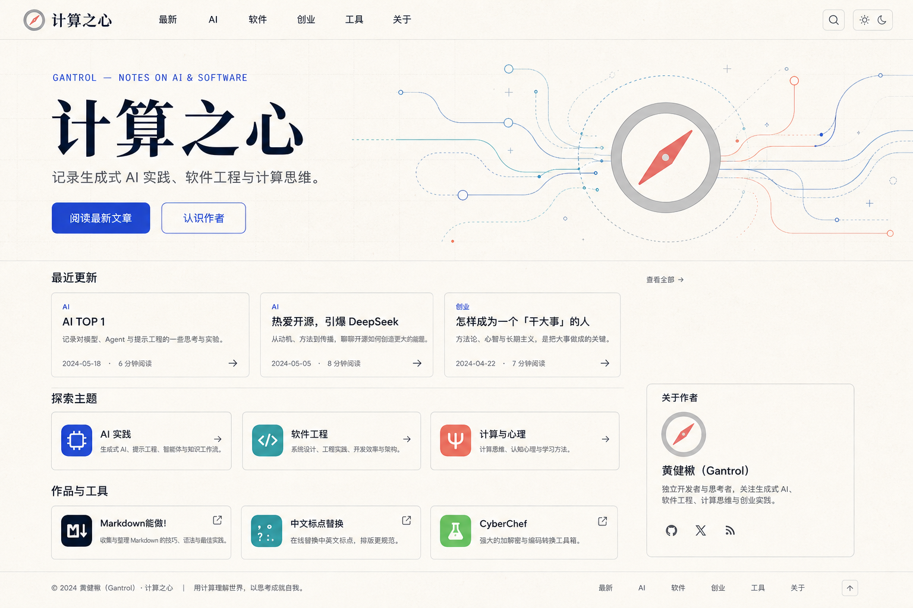
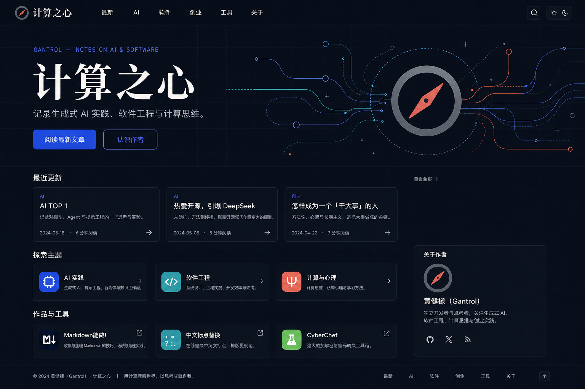
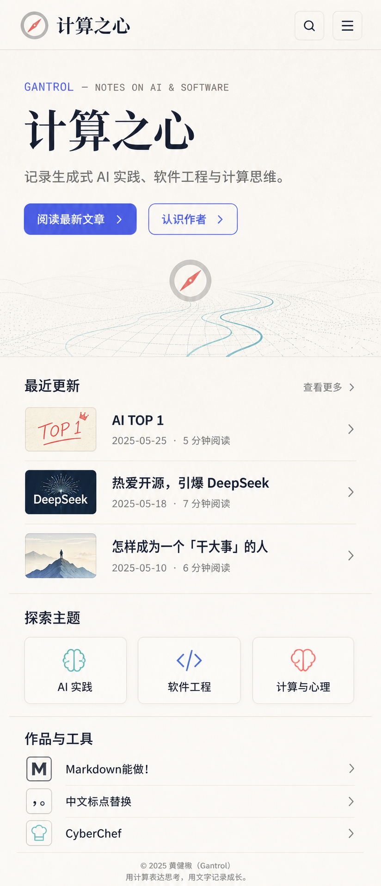

# 「计算之心」首页视觉改版方案

状态：GPT Image 2 概念阶段，等待确认后实施  
日期：2026-08-12  
方向：编辑型计算手记（Editorial Lab）

## 概念稿

### 桌面端 · 浅色



### 桌面端 · 深色



### 移动端 · 浅色



> 这些图片是视觉与信息架构参考，不应直接作为网页背景切图。正式实现应使用 HTML、CSS、Vue 和 SVG，以获得清晰文字、响应式布局、暗色主题与更好的性能。

## 1. 目标

1. 把首页从「VitePress 默认 Hero + 三张卡片」升级为完整的个人知识站入口。
2. 建立独特的品牌语言：以现有指南针 Logo 为核心，将“路径、节点、探索、计算”统一成一套图形系统。
3. 强化文章发现：优先展示最近更新、主题入口、作品与工具，而不是只描述作者身份。
4. 保持文档阅读体验，不影响现有 VitePress 内页、搜索、侧栏和中英文路由。
5. 同时覆盖浅色、深色和移动端，满足可访问性与性能要求。

## 2. 当前问题

- 首页实际只渲染 Hero、三张 Feature 卡和 Footer；`highlights`、`newsletter` 不是默认 VitePress 首页字段，目前不会显示。
- 浅色科技背景透明度很低，但文件约 1.19 MB；深色背景约 1.79 MB，视觉收益与加载成本不匹配。
- 紫青渐变、粒子科技树和珊瑚红指南针分属不同视觉语言，品牌记忆不统一。
- Hero 缺少作者定位与读者价值说明；首页也没有最近文章、代表作品或关于作者。
- 心理学卡片没有链接且标注“年久失修”，但仍呈现可点击的悬停反馈。
- 现状截图中导航和第三张卡出现横向裁切；整体对比度偏低。
- 无限渐变、卡片扫光、浮动等动效没有 `prefers-reduced-motion` 处理。

## 3. 推荐视觉方向

关键词：理性、温暖、编辑感、个人性、可长期维护。

- 基底采用暖纸白与深墨色，弱化通用 SaaS/AI 霓虹感。
- 主标题使用现代宋体风格，正文和界面采用清晰中文无衬线，元数据可用等宽字体。
- 保留现有灰色圆环与珊瑚红指针，将其延展为“指南针 + 计算路径 + 节点”的右侧 Hero 线稿。
- 卡片只服务于可点击内容；其余信息用细线、间距和字号建立层级。
- 背景只保留轻微纸张颗粒与技术网格，不再使用固定的重型位图背景。

## 4. 设计令牌

### 浅色

| 角色 | 色值 | 使用方式 |
| --- | --- | --- |
| 页面背景 | `#F5F2EA` | 暖纸白 |
| 主文字 | `#151924` | 标题、正文、导航 |
| 主品牌色 | `#5660E8` | 主按钮、链接、焦点态 |
| 辅助色 | `#2BA7B8` | 图形节点、图标；不用于小号正文 |
| 指南针红 | `#E86161` | 指针与少量强调；不用于大段文字 |
| 分隔线 | `#DCD7CC` | 1px 规则线与卡片边框 |
| 表面 | `#FBF9F4` | 卡片与浮层 |

### 深色

| 角色 | 色值 | 使用方式 |
| --- | --- | --- |
| 页面背景 | `#10131C` | 深蓝黑 |
| 抬升表面 | `#171B26` | 卡片、菜单、搜索浮层 |
| 主文字 | `#F2EFE7` | 标题、正文 |
| 次文字 | `#AEB5C4` | 元数据、辅助说明 |
| 主品牌色 | `#7C85FF` | 主按钮、链接、焦点态 |
| 辅助色 | `#55C5D0` | 图形节点、图标 |
| 指南针红 | `#FF7B78` | 指针与少量强调 |
| 分隔线 | `#2B3040` | 规则线与边框 |

### 排版与几何

- 展示标题：现代中文宋体/衬线回退栈，桌面约 `72–88px`，移动约 `52–60px`。
- 正文与界面：中文无衬线回退栈，正文 `16–18px`，行高 `1.65–1.8`。
- 元数据：等宽字体，`12–13px`，只用于标签、日期和阅读时间。
- 页面最大宽度：`1280px`；桌面采用 12 栏网格。
- 间距遵循 4/8px 基线；主要区块垂直间距 `64–96px`。
- 圆角 `10–14px`；阴影克制，默认以边框区分层级。

## 5. 首页信息架构

1. **顶部导航**：Logo + 计算之心、最新、AI、软件、创业、工具、关于、搜索、主题切换。
2. **Hero**：作者标签、站名、价值说明、两枚 CTA，以及指南针计算路径图形。
3. **最近更新**：三篇精选/最新文章，展示主题、标题、摘要、日期和阅读时间。
4. **探索主题**：AI 实践、软件工程、计算与思考。若心理栏目仍无有效入口，实施时用“创业与思考”替代。
5. **作品与工具**：Markdown能做！、中文标点替换、CyberChef。
6. **关于作者**：黄健楸（Gantrol）的简短介绍与社交链接。
7. **Footer**：版权、主要导航、返回顶部。

所有日期、摘要和阅读时间均应在实现阶段从真实内容数据生成或维护；概念稿中的日期仅为版式占位。

## 6. 响应式规则

- `>= 960px`：12 栏桌面布局；Hero 左文右图；文章卡三列；作者信息位于右侧。
- `640–959px`：Hero 图形缩小并下移；文章卡两列或水平列表；导航收敛。
- `< 640px`：单列；紧凑顶栏；最近文章优先于主题；指南针图形压缩为浅横幅；工具使用列表而非巨型卡片。
- 所有宽度都不得出现横向滚动；触控目标至少约 44px；按钮允许并排但不能挤压文字。

## 7. 交互与可访问性

- 主按钮、链接与焦点态使用高对比钴蓝；青色和珊瑚红主要用于非文字装饰。
- 卡片悬停位移控制在 `2–3px`，不再使用大幅上浮与扫光。
- 支持 `prefers-reduced-motion: reduce`，关闭非必要动画。
- Hero 路径可做一次性、低频的 SVG 描边动画；禁止常驻粒子计算。
- 保留 VitePress 本地搜索、键盘导航和明暗主题切换。
- 文章卡、主题卡和工具项必须有明确链接；不可点击内容不使用悬停抬升。

## 8. 实施建议

1. 新建首页专用 Vue 组件与数据文件，只替换中文首页渲染；不改默认文档内页布局。
2. 用 CSS/SVG 重建指南针路径插画；概念 PNG 只作为视觉验收参考。
3. 移除首页无效的 `highlights`、`newsletter` frontmatter，改为真实组件区块。
4. 先完成结构、排版和响应式，再加入浅/深色令牌与小型动效。
5. 在 390、768、1024、1440px 宽度做截图回归，并检查无横向裁切。
6. 构建后检查首页资源体积、LCP、键盘焦点、颜色对比和 reduced-motion。
7. 当前仓库已有较多未提交更改，实施时只做小范围补丁并保留已有工作。

## 9. 验收标准

- 首页能看到 Hero、最近更新、主题、工具、作者和 Footer，且均使用真实链接。
- 390–1440px 无横向滚动、导航裁切或卡片截断。
- 浅色与深色模式均具有清晰正文对比度。
- 不再加载当前两张重型科技树首页背景。
- 非必要动画在 reduced-motion 下完全关闭。
- `npm run build` 成功，现有文档页样式与导航不回归。
- 视觉上能一眼识别“计算之心”的指南针母题，而不是通用 AI 模板。

## 10. GPT Image 2 最终提示词摘要

### 桌面浅色

```text
Use case: ui-mockup
Asset type: high-fidelity desktop homepage redesign concept, landscape
Primary request: 为中文个人博客“计算之心”设计一张可实现的高保真首页概念稿。作者是黄健楸（Gantrol），主题是生成式 AI、软件工程、计算思维与创业。整体方向是“编辑型计算手记 / Editorial Lab”，像一本现代独立科技杂志，而不是 SaaS 落地页。
Composition: 1536×1024 landscape, slim navigation, 12-column editorial grid, left-aligned Hero copy, right-side compass and computational-path line illustration; recent articles, topics, tools and author block below.
Typography: modern Chinese Song-style serif display title, Chinese sans-serif body/UI, monospace metadata.
Palette: warm paper #F5F2EA, ink #151924, cobalt #5660E8, teal #2BA7B8, compass coral #E86161.
Constraints: real buildable VitePress/Vue screenshot, accurate Chinese, high contrast, no browser frame or watermark.
Avoid: generic AI neon, glassmorphism stacks, particle forests, 3D spheres, emoji-led cards, huge empty Hero, clipped navigation/cards, garbled Chinese.
```

界面文本：`计算之心`、`最新`、`AI`、`软件`、`创业`、`工具`、`关于`、`GANTROL — NOTES ON AI & SOFTWARE`、`记录生成式 AI 实践、软件工程与计算思维。`、`阅读最新文章`、`认识作者`、`最近更新`、`AI TOP 1`、`热爱开源，引爆 DeepSeek`、`怎样成为一个「干大事」的人`、`探索主题`、`AI 实践`、`软件工程`、`计算与心理`、`作品与工具`、`Markdown能做！`、`中文标点替换`、`CyberChef`。

### 移动浅色

```text
Use case: ui-mockup
Asset type: high-fidelity responsive mobile homepage redesign concept, portrait
Primary request: 为“计算之心”设计 390px 宽移动端首页，作为 Editorial Lab 桌面方案的响应式版本；文章易读、导航可靠、触控舒适。
Composition: 390×1400-style portrait, single column, compact sticky header, concise Hero, shallow compass-path accent, recent articles before topics, compact tool lists.
Typography and palette: same system as desktop.
Constraints: accurate Chinese, safe side padding, accessible contrast, no horizontal overflow, no clipped content, no watermark.
Avoid: oversized mobile Hero, giant cards for every row, tiny controls, desktop navigation forced onto mobile, garbled text.
```

### 桌面深色编辑

```text
Use case: precise-object-edit
Input: the generated light desktop concept.
Primary request: change only the theme colors, surfaces, lighting and dark-mode contrast; preserve exact layout, typography hierarchy, illustration geometry, component proportions, content order and text.
Palette: #10131C, #171B26, #F2EFE7, #AEB5C4, #7C85FF, #55C5D0, #FF7B78, #2B3040.
Constraints: real buildable VitePress/Vue screenshot, accessible contrast, no new sections, no duplicated elements or layout drift.
Avoid: cyberpunk neon, luminous glassmorphism, crushed blacks, glowing borders, altered Chinese.
```

