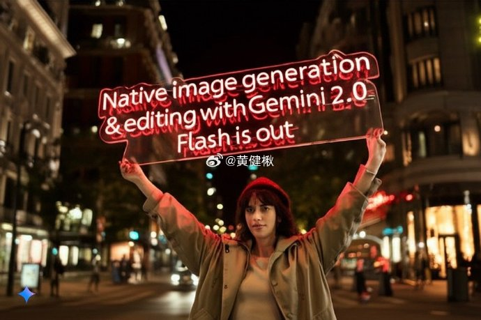
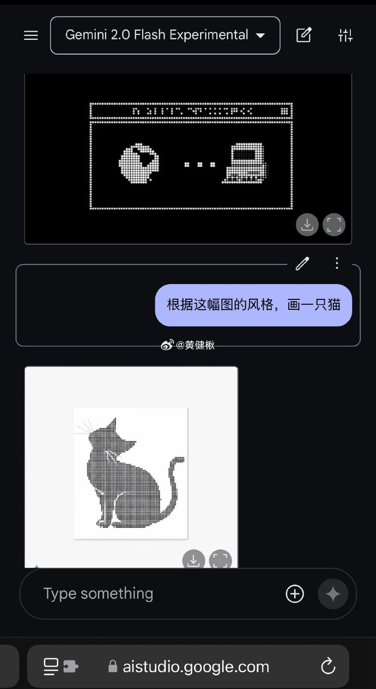
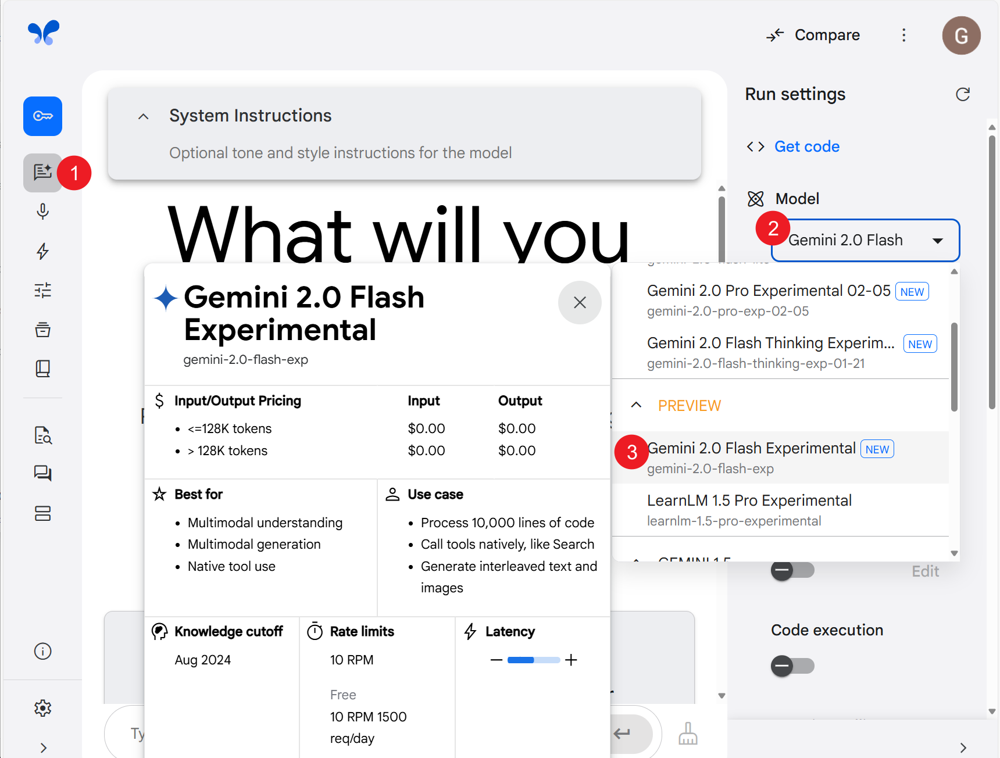

# Gemini 原生画图能力

> 本文初稿首发微博[点击查看](https://weibo.com/6083767801/Pih7B2lG9)

大模型原生画图能力，突破纯文字输出，谷歌发布Gemini 2.0 Flash Experimental，亮点如下：

- 不刚需英文提示词
- 能画出文本，包括中文❗️
- 可以对话修改，同样，可以用中文
- 能拷贝风格

- 能描述图片，给自己生成提示词
- 能生成故事集+插图（图五、要指定张数，时灵时不灵，还有图六这种限制）……

案例集：

- 喵娘。让Gemini生成一只喵娘，并让它扮演，再画一幅自画像，然后戴上“生气”发夹http://t.cn/A6BcLvu8

- 三只小猪故事集（未完待续）
- 改字（一些简单中文）http://t.cn/A6BV1vpy
- 这衣服像窗帘吗 http://t.cn/A6BIwQJx

局限
- 有些字不行，还会出现缺笔画
- 改图有时不好用怎么办？http://t.cn/A6BVo0KZ
- 美感不如专业文生图模型，比如 image-fx http://t.cn/A6BV3ZMc
- 审核比较重，关闭所有审核选项后，人像也特别敏感 http://t.cn/A6BfXxsd

去[AIStudio](https://aistudio.google.com/)跟着图二选模型就可在线体验（需自行解决网络问题）：http://t.cn/A6nrwqj6

[该功能官方发布文章](https://developers.googleblog.com/en/experiment-with-gemini-20-flash-native-image-generation/)
