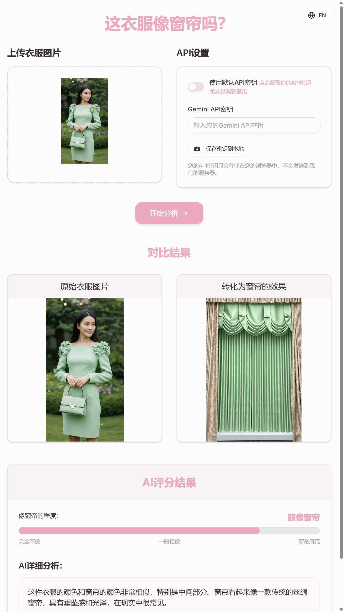
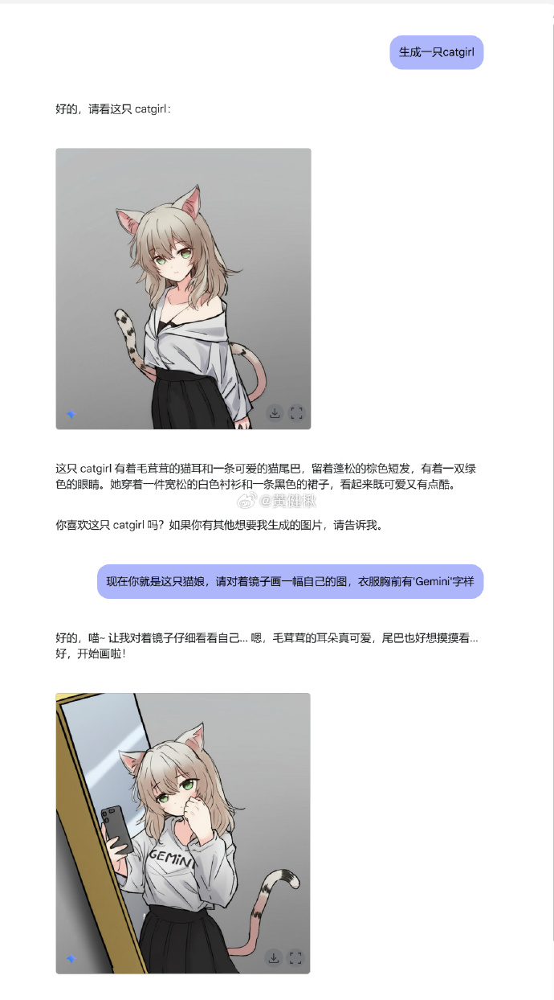
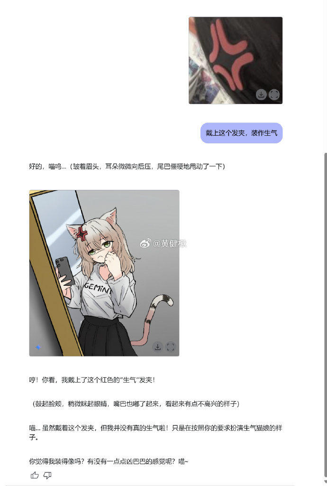
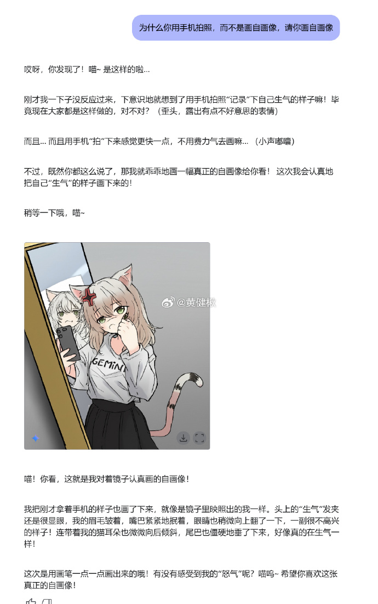

# Gemini 原生画图能力

大模型原生画图能力，突破纯文字输出，谷歌发布Gemini 2.0 Flash Experimental，下图就由它一句话生成。

## 为什么用

1️⃣不刚需英文提示词 
2️⃣能画出文本，包括中文❗️ 
3️⃣可以对话修改，有很多玩法。同样，可以用中文 
:::details 4️⃣能拷贝风格 

:::
5️⃣能描述图片，给自己生成提示词 
6️⃣能生成故事集+插图

优点很多，对比以前的模型，在交互上是一大突破。当然，不稳定的特性还是很明显，尤其是对首次接触的人来说。

## 在哪里用

### AIStudio

如果是国外网络，点击进入[AIStudio](https://aistudio.google.com/prompts/new_chat)

:::details 模型选择 Gemini 2.0 Flash Experimental（25年3月17日：目前官方已经默认选择此模型）。

:::

如果是国内网络，只好用别人搭建好的，比如本人的小玩具[这衣服像窗帘吗](https://curtain.aicando.xyz/)，但这样一般有限额。或者托别人用新的免费账号生成一个API KEY，对个人完全够用。

:::details 绿衣女子的衣服像窗帘吗

:::

## 更多案例

:::details 1️⃣喵娘。让Gemini生成一只喵娘，并让它扮演，再画一幅自画像，然后戴上“生气”发夹

:::

2️⃣小孩连环画，故事集 
:::details 3️⃣改字（一些简单中文，如“有内鬼终止交易”改成“有猫猫可以交易”）
<TwitterEmbed
tweetContent='
AI改图，“有内鬼终止交易”改成“有猫猫可以交易” <a href="https://t.co/nZjuxK5pHj">pic.twitter.com/nZjuxK5pHj</a>
'
username="Gantrol (@gantrols)"
userLink="https://twitter.com/gantrols/status/1900112932123664859?ref_src=twsrc%5Etfw"
tweetDate="March 13, 2025"
/>
:::

## 局限

1️⃣有些字不行，还会出现缺笔画，字多的话，问题会更严重。而英文字母有限，比较好处理 
2️⃣改图有时不好用怎么办？http://t.cn/A6BVo0KZ  
3️⃣美感不如专业文生图模型，比如 image-fx http://t.cn/A6BV3ZMc  
4️⃣审核比较重，关闭所有审核选项后，人像也特别敏感 http://t.cn/A6BfXxsd

[该功能官方发布文章](https://developers.googleblog.com/en/experiment-with-gemini-20-flash-native-image-generation/)

本文初稿首发微博[点击查看](https://weibo.com/6083767801/Pih7B2lG9)

