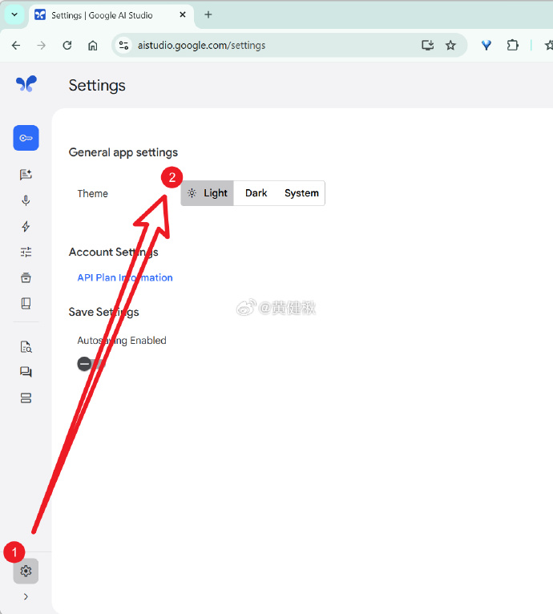
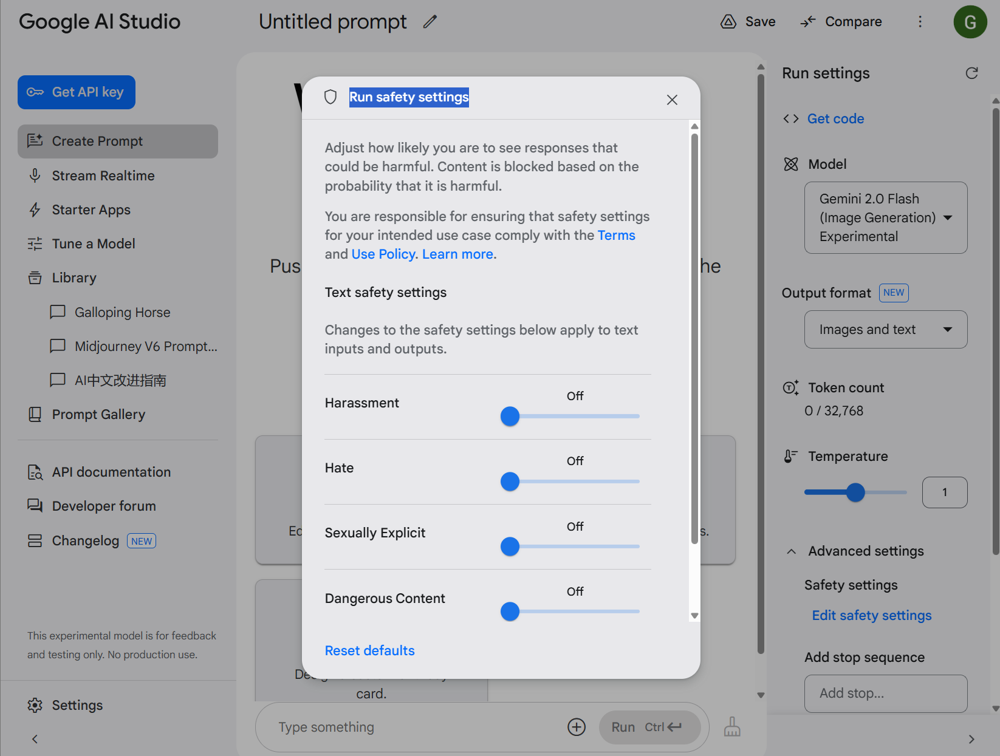
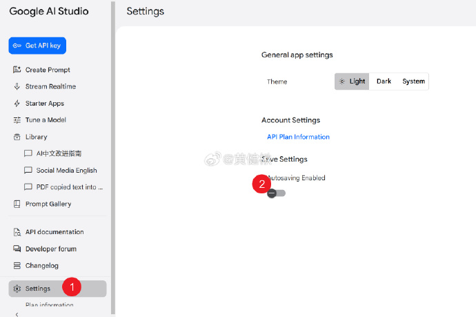
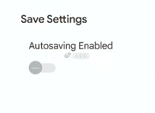
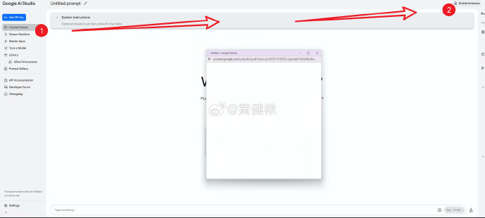

# AIStudio 操作备忘

[AIStudio](https://aistudio.google.com)是为（国外）开发者设计的，好处是额度足够小规模应用开发使用，更别提个人用了。坏处是过于复杂，如果DeepSeek是自动驾驶，那么AIStudio估计是手动开飞机，面对一排按钮、开关。

实在觉得太复杂，[Gemini 也有 App 端](https://gemini.google.com/)，文字操作跟 DeepSeek 大差不差，可以参考[老妈都能玩转的 deepseek 教程](/AI/use/how-to-chat/deepseek)

## 常用操作

::: details 谷歌AIStudio怎么看模型上下文多大，以及每天多少条、每分钟多少条的限制？

### 查看模型相关信息

【建议在桌面端操作，窗口中等宽度以上】鼠标悬浮在右侧设置模型选择器上，就有模型信息弹出。Rate Limit便是，图一是一般Gemini 2 模型的限制，免费档每分钟10次请求（不清楚收费档有没改），免费档限制每天1500次请求

蓝框内token count意味着每个会话100w上下文

小规模应用开发应该都够用，更别提个人使用了，不过收费模型2 Pro不一样（图二），每个会话200w上下文，收费档每分钟1000次请求（问题），免费档每分钟两次请求，每天50次请求
:::

### [怎么开启搜索](./search)

### 手机怎么使用？浏览器点击这个链接就好：[AIStudio](https://aistudio.google.com)

:::details 切换白天/夜间模式
### 切换白天/夜间模式

AIStudio调白天模式的方法。夜间模式其实对眼睛不算友好，尤其是有散光的人

:::

:::details 同时比较不同模型或参数

### 比较模式

Compare模式，就是比较：提示词、稳定性（temperature）、Top P等。

Compare在右上角，桌面端宽屏时才会出现。点击后会变成两栏，可以选不同模型。但这时系统提示词（system instructions）同步，取消点击“Sync”按钮后，才能在两侧输入不同系统提示词

配置好模型跟提示词后，就可以向两边同时发送相同指令，比较结果了
:::

:::details 安全设置
### 安全设置

虽然能放开很多选项，但还会有一些限制

:::

:::details 当英语口语陪练
### 音频、视频对话：把AI Studio（Gemini 2）当英语口语陪练{#English}

进入[网站](aistudio.google.com/live) 登录后，先别说话，输入下面的prompt

#### Prompt开始
Hello, as my English speaking coach, please help me practice spoken English communication. When I speak English, please pay attention to my pronunciation, and promptly point out any errors you notice, providing correct pronunciation demonstrations and pronunciation tips.

We can engage in various daily conversation topics, such as self-introductions, travel, work, hobbies, and more.

When I indicate that the practice session is over，或者用中文说“谢谢，结束”, please summarize my common pronunciation issues. If there are many problems, please first select the most severe ones and address them step by step.

#### Prompt结束

这个prompt主要有三段，第一段说扮演英文口语教练，第二段是话题，第三段是如果用户说结束，总结之前的发音问题，如果有很多问题，总结最严重的（嘴下留情[doge]）

根据你的偏好，你可以自行修改，尤其是话题（ daily conversation topics）

另外根据AI Studio的特性，第一段英文发出去后，不论你说英语还是中文，后续基本只会跟你说英文

#### 实际表现

具体看图一，Gemini指出问题挺准确的，最后的总结也不错。希望后续有相关应用优化这一场景
:::

:::details 怎么有“聊天记录”
### 怎么有“聊天记录”

Google AIStudio也能有“聊天记录”，去设置把 Autosaving Enabled 打开就行

如果像图二那样，无法开启，

那么去Prompt处点击Enable Autosave，去登录（图三）

然后在Library处可以看“聊天记录”

不过我个人不喜欢用这个设置，遇到有用的手动Save就好
:::

### [画图](./draw#在哪里用)

1️⃣不刚需英文提示词 
2️⃣能画出文本，包括中文❗️ 
3️⃣可以对话修改，有很多玩法。同样，可以用中文 
:::details 4️⃣能拷贝风格 

:::
5️⃣能描述图片，给自己生成提示词 
6️⃣能生成故事集+插图

### [上传附件📎](https://www.gantrol.com/software/code/zed/crate-analyse){#file}

## 常用用例

- [处理PDF](https://weibo.com/6083767801/PeJxZASQa)

:::details 根据图片定位
### 定位图片大体位置

给你下图，你能判定图中是什么地方吗？Gemini 2 FTE可以直接判定

有个网站叫[图寻](https://tuxun.fun)，这题是今天挑战的一题，每提限时五分钟，在Gemini协助下（给出大概范围后点中间），满分五千获得四千九。另外今日五题两万出头，排行95%+

首发于[微博](https://weibo.com/6083767801/5140447313005885)
:::

### [阅读大型仓库代码](https://www.gantrol.com/software/code/zed/crate-analyse)

### [去AI味儿，用于翻译、润色](/AI/use/translate/)

### [模仿社媒风格写作（如小红书）](/AI/use/social/xiaohongshu)

### [语音/视频对话、练习口语（在上面↑）](#English)
