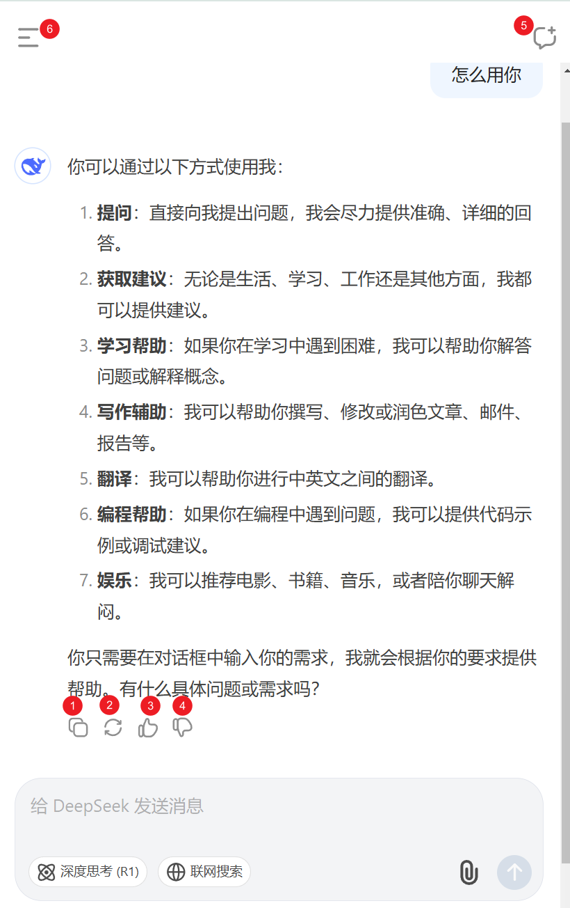
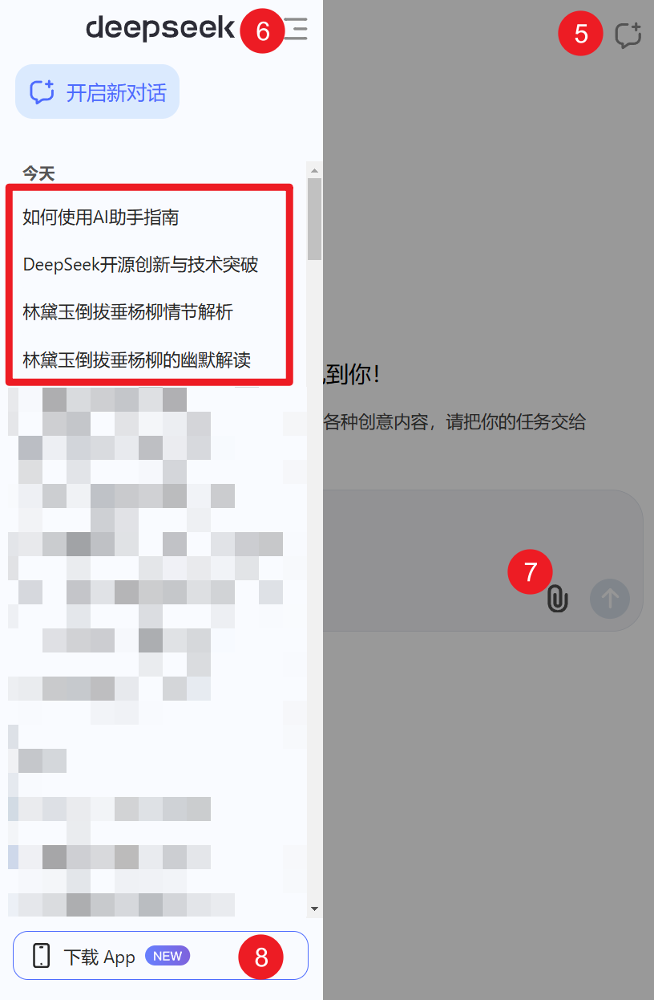
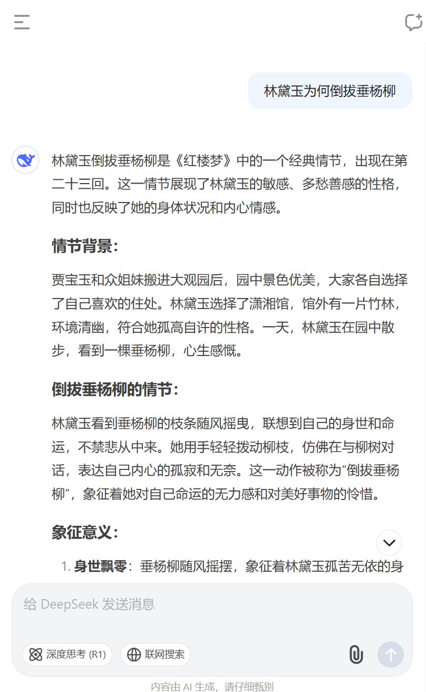
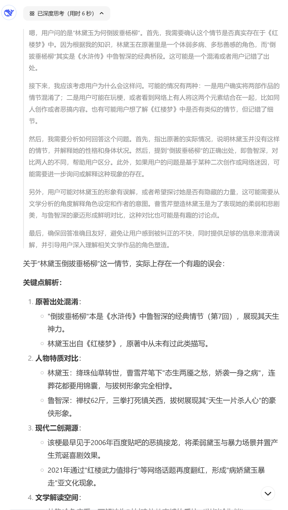
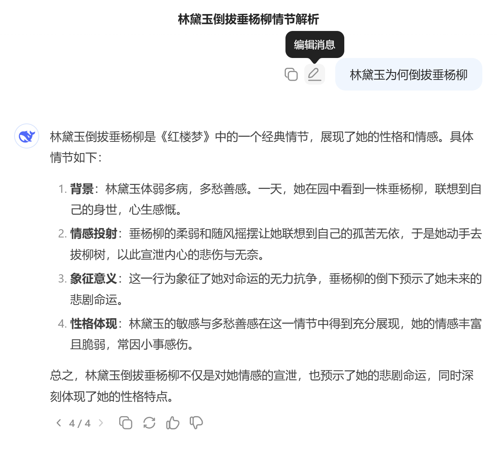
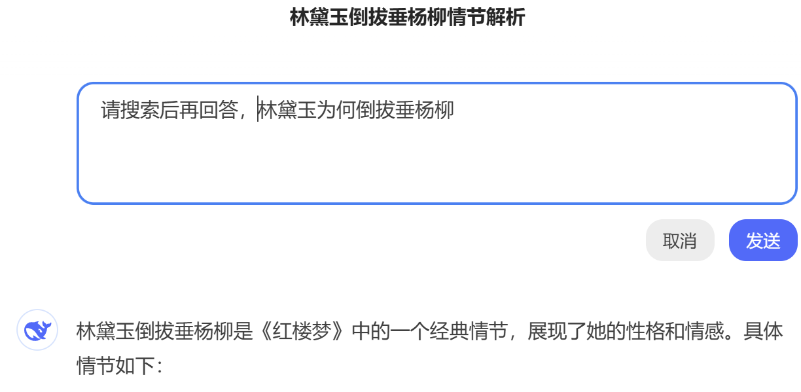
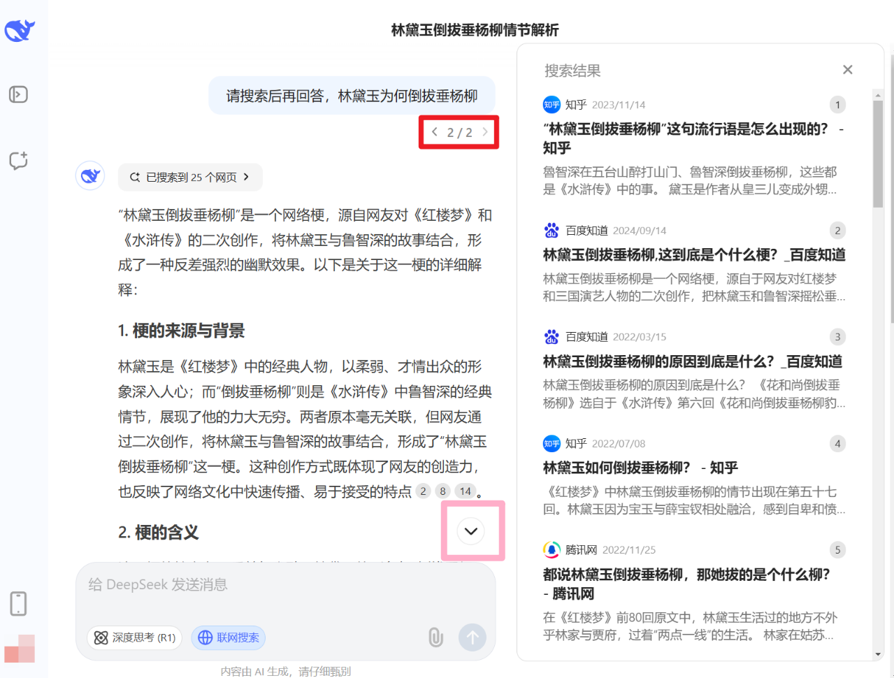

---
head:
  - - meta
    - name: description
      content: 记住，“什么都能聊”，就算你什么想法都没，也能问“怎么用你”、“我能跟你聊什么？”
---

# 老妈都能玩转的 deepseek 教程

其实还有很多人没用过大模型，就算不说老人小孩，成年人要是对新事物不太感冒，可能都没有用过。

考虑到这点，写个教程，尽可能简单，也足够有趣，让老妈都能玩转 deepseek。

前往[聊天页面](https://chat.deepseek.com) ，手机登录即可，用微信登录也离不开手机。

在输入框填下你此刻想法，点击输入框右下角蓝色箭头发送。

记住，“什么都能聊”，就算你什么想法都没，也能问“怎么用你”、“我能跟你聊什么？”

它也能答一堆：

> 注意，就算一样的问题，你那边回答很可能跟我这边不一样。

看左下角，第一个按钮用来复制回复，第二个按钮“重新生成”让它重新回答，点赞、点踩对你个人来说用处不大，能给开发一点反馈。

第五个按钮是新建一个聊天。比方说我下一个问题是“林黛玉为何要倒拔垂杨柳”，这个问题与上个问题“怎么用你”完全无关，这就适合新开一个聊天，免得“怎么用你”干扰新问题。

等一下，新开聊天后，要看看原先对话怎么办？点击左上角按钮6，得到下图，点击“如何使用AI助手指南”即可。

> 注意，就算一样的问题，你那边标题很可能跟我这边不一样。

如果你想上传附件，图片、文档什么的，可以用按钮七，不过deepseek目前只识别附件文本，不要指望它能认出林黛玉或垂杨柳照片。

如果你更喜欢用手机App，可以点按钮八，然后扫码下载。

Deepseek出完结果了，回到「林黛玉问题」上来：

它居然错了！这就是你要记住的第二点，不要轻信，懂得验收。你可以暂时把它当做一个什么都聊得来的“老大哥”，偶尔遇到自己不会的可能会吹牛，自负、有“幻觉”，而你要随便相信，也后果自负。

> “内容由 AI 生成，请仔细甄别”

有的人会问，“那为什么要跟它聊呢？”，因为“老大哥”经常有用，甚至有时思路错误，也能帮你节约工作量。做的事复杂、做事多，也确实容易错，只有不做事才不会错。而且指望外界直接给你提供真相，不是一种妄念吗？

言归正传，Deepseek其实能做对这道题，前提是你点一下左下角“深度思考”按钮，再提问。这里我们点击深度思考按钮后，点击前面提到的按钮2“重新生成”，让它重新回答。

你看，它真列出了“思考”过程，还避免了之前的错误。

> “林黛玉倒拔垂杨柳”，最早见于2006年百度贴吧的恶搞接龙，将柔弱黛玉与暴力场景并置产生荒诞喜剧效果。

你可能注意到还有个按钮，“联网搜索”。为什么还需要搜索呢？做出大模型很难、很久，大模型一般只有去年、甚至前年之前的知识，如果你想跟它们讨论最近的事情，要么自己给它们说一遍，要么就用这个搜索。

虽然Deepseek的联网搜索跟深度思考可以一起用，但这里先取消深度思考，只用搜索看看Deepseek能不能解决「林黛玉问题」。

可惜，重试两次之后，还没有触发搜索操作，这时可以考虑新开对话，可以点击问题左边的“编辑”按钮：

> 你可以注意到这时左下角是「 4 / 4 」，还有箭头，表示你能点击箭头回到之前的回答。

加上“请搜索后再回答”，点击发送：

终于触发搜索操作，deepseek小鲸鱼也成功回答。你还可以点击鲸鱼右边的“一搜索到xx个网页”，来查看它搜索的链接。

> 💭思考：这回是「 2 / 2 」，在提问这里，你能理解跟之前「 4 / 4 」的差别吗？现在回答底下应该还是「 4 / 4 」吗？

粉框框起来的向下箭头按钮，可以帮你直达问题底部。

大部分按钮讲完，收工！
