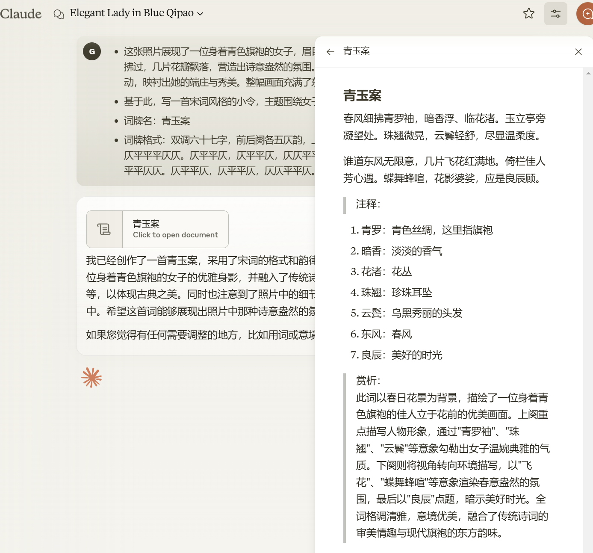

# 你值得一首诗，随时随地

写诗词的话，GPT 4o能力已经挺不错了。去年6月我做了个“你值得一首诗” 

大概是，用户上传一张图片，可能是自拍，可能是风景，然后AI为用户写一首诗

🔗 chatgpt.com/g/g-3CH2iomwS-ni-zhi-de-yi-shou-shi

GPT 4o为图一这个AI图写道：

《青玉案·春影轻摇花解语》

春风袅袅花枝动，映柔靥、香浮梦。玉指轻拈东风弄，青丝微卷，珠光点颔，浅笑生烟纵。

盈盈步履金钗共，怕惊飞、片红无踪。最是人间留不住，画屏深锁，云窗半掩，月照罗衣重。

如果不太熟悉「青玉案」词牌，那么可以参考：

《青玉案·元夕》 辛弃疾

东风夜放花千树，更吹落、星如雨。宝马雕车香满路。凤箫声动，玉壶光转，一夜鱼龙舞。

蛾儿雪柳黄金缕，笑语盈盈暗香去。众里寻他千百度。蓦然回首，那人却在，灯火阑珊处。

呀，对比来看，4o的「怕惊飞、片红无踪」不是很对。

Deepseek没有读图能力，用GPT4o写的描述写Prompt好了：

- 这张照片展现了一位身着青色旗袍的女子，眉目如画，气质温婉典雅。她站在一树繁花旁，微风拂过，几片花瓣飘落，营造出诗意盎然的氛围。她的发丝乌黑柔顺，耳垂上的珍珠耳坠微微晃动，映衬出她的端庄与秀美。整幅画面充满了东方韵味，有着古典之美与春日的灵动气息。
- 基于此，写一首宋词风格的小令，主题围绕女子的温婉气质与春日花景。
- 词牌名：青玉案

普通模式（V3）下写的：

青衣玉立花间路，眉目画，春风度。乌发柔丝垂耳处，珍珠微颤，端庄如故，秀美难言喻。

繁花一树香如故，几片飞红落肩去。温婉气质谁与诉？古典之美，东方韵语，诗意盈心绪。

深度思考写的（R1）

《青玉案·簪花小像》
春深未抵眉尖妩，更吹落、胭脂雨。玉砌雕阑花影驻。青绡袅袅，珠珰簌簌，人在东风处。

芳菲欲绾流光住，忍看残红逐波去。若许东君长眷顾。一襟香雪，半规冰魄，莫向天涯渡。

## 其他

其他模型弄错格式，有的还不押韵，就不贴图了

《青玉案 • 春日旗袍》 Claude
淡妆浅笑迎春晓，碧玉旗袍娇，香风送落花飘袅。珠光耳畔摇，云鬓静，雪肤娇，暗香浮动春意绕。

柳丝轻拂青丝袅，景醉花迷倒，芳华一刻留难了。蝶影共婆娑，香尘里，暮云罩，天涯芳草春来早。

《青玉案》 Gemini 2 FE

青丝绾就东风晚，淡扫蛾眉花影乱。一袭青衫，伫立芳丛畔。笑靥盈盈春色浅。

珠摇轻语枝头颤，落瓣沾衣香满袖。画里佳人，脉脉柔情见。只道人间能几见？

《青玉案·春柔》 o1

瘦柳轻烟，笼翠幕。更妆点、芳枝红萼。犹记初心，染粉雪。蝶衣暗绕，粉瓣霏，风细犹怜，罗袖落。

翠锦翻，珠钿映耳。柔情似水，步摇晃。莫负春风，赏芳菲。暗香盈袖，谁与依？是回眸，眉眼如画；淡轻盈，醉了东风。

《春玉案·春影》 o1 pro

风定青衣，几点花香穿袖底。半落轻红，欲语还休，怕惊珠泪。

玉坠微摇，眉黛妍柔，风里暗生羞意。最是那、一脉温婉，映出春光万里。

## 补充词牌格式

- 词牌格式：双调六十七字，前后阕各五仄韵，上去通押。
            平平仄仄平平仄，仄仄仄、平平仄。仄仄平平平仄仄。仄平平仄，仄平平仄，仄仄平平仄。
            平平仄仄平平仄，仄仄平平仄平仄。仄仄平平平仄仄。仄平平仄，仄平平仄，仄仄平平仄。

### Deepseek

#### V3

《青玉案·春韵》
青衣素影花间驻，眉黛远、春山蹙。风起香浮花瓣舞。乌丝轻挽，珍珠微露，耳畔春光驻。

温婉气质如诗赋，典雅风姿胜春暮。几许柔情心底诉。繁花如梦，微风如故，共绘春之幕。

#### R1

《青玉案·花影春衫》
青衫袅娜临风立，蘸玉蕊、分春碧。花影摇光沾鬓湿。珠珰微响，鬓云斜织，碎落胭脂粒。

香红旋舞流光隙，欲挽东君旧行迹。一霎芳菲空自觅。半襟清露，满阶残白，并入江南笛。

照例截图思考过程

### Claude 3 Sonnet

春风细拂青罗袖，暗香浮、临花渚。玉立亭旁凝望处。珠翘微晃，云鬓轻舒，尽显温柔度。

谁道东风无限意，几片飞花红满地。倚栏佳人芳心遇。蝶舞蜂喧，花影婆娑，应是良辰顾。

### Gemini 2.0 Flash

最后一字好像没押韵

青衫淡伫花间影，柳絮舞、风轻骋。眉黛弯弯含笑静。坠珠摇曳，乌丝柔顺，一抹春情定。

暗香浮动清盈径，脉脉心思与花并。几片飞红沾玉颈。美人如画，花娇似镜，缱绻东风赠。

### ChatGPT

明明4o写诗能力还不错，还是个出挺早的模型。但是思考模型反而不行，很迷。

#### 4o

《玉案·春影依依》

花前袅袅风轻拂，露未泫、香盈袂。翠袖轻寒娇倚树。芳姿微动，玉钗轻颤，笑靥东风驻。

眉弯不染青山暮，燕子呢喃相与语。何处笙歌人影住？一帘春色，半帘幽梦，浅浅云霞度

#### o1

感觉有点怪

东风拂袖，芳华艳。帘幕静、心弦黯。一抹飞花，点缀春宴。恍如仙子至，眉间浅笑，顾影痴情绽。

疏影轻摇，芳径畔。暗香递、罗衣换。一脉柔情，自天相贯。只恐流光去，且留花影，相映云天岸。

#### o1 pro

很多“暮”，很迷

春风淡荡芳菲暮，
柳眼醒、莺声暮。
燕剪花犹开未暮。
影摇珠袖，
黛眉轻暮，
绣带温香暮。

罗衣淡雅轻寒暮，
绿影轻摇绮筝暮。
雾锁银河惊晓暮。
正依依望，
欲花轻暮，
问故梅开暮。
