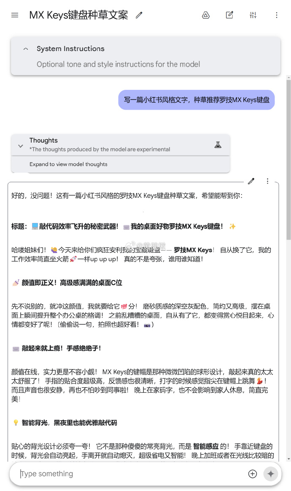

# 模仿小红书风格

## 产出流程

1. 提炼主题：根据用户输入，确定发文章的机构与文章的核心主题，如果有图片输入，图片一般是之前的顾客。
2. 具体受众分析：根据受众兴趣，与主题取交集，列出高效的搜索词
3. 写出核心信息，对齐机构目标与受众兴趣：根据受众分析，调整核心信息以满足“简练”原则，同时满足机构发文吸引潜在用户的目的，并且优化搜索词。
4. 写出四个标题：
    - 第一个中规中矩。
    - 第二、第三个让人意外。
    - 第四个比较离奇。
5. 列出可能涉及的故事、经历、类比或数据：让内容更具体和生动。
6. 提炼社交媒体标签：根据可能的搜索词，选择合适的标签，以扩大传播效果。
7. 写出两个符合机构风格的参考文案
8. 反思两个文案的优缺点，然后修改，重点修改其中不恰当的、不合机构为主体的地方
9. 最后输出标题，以及一份最佳参考文案。（另外考虑用emoji来“活跃”文本，尤其是替换列表项的头）

## 受众分析

小红书的读者主体是女性，她们喜欢内容简单易懂、不费脑筋

她们的阅读习惯类似于逛街，每条内容只有几秒钟时间来吸引她们注意

在列表页中，只能看到图片跟标题。还要与周围六个左右帖子竞争

## 直接问

