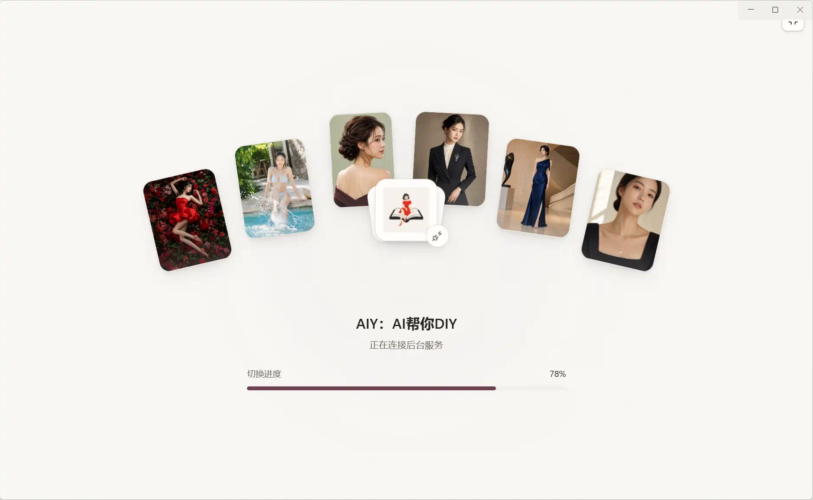
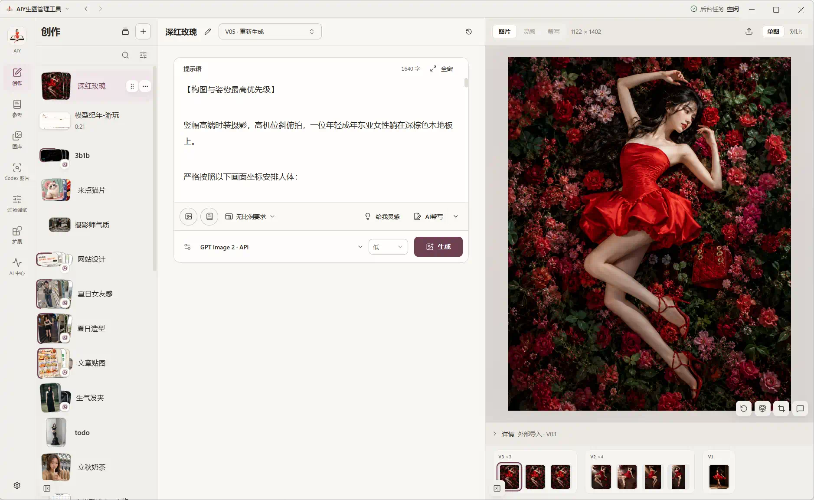
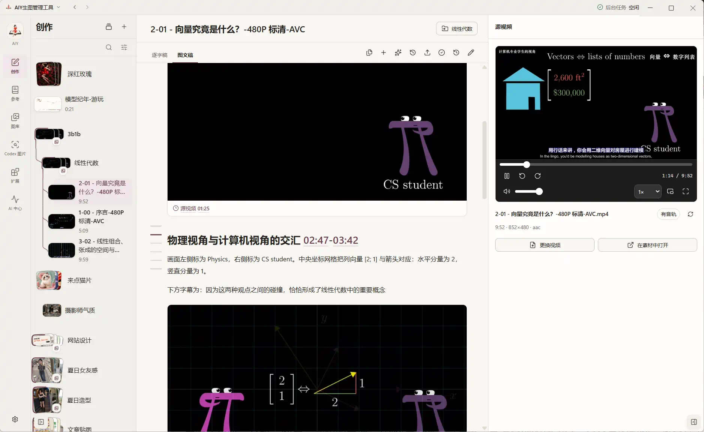
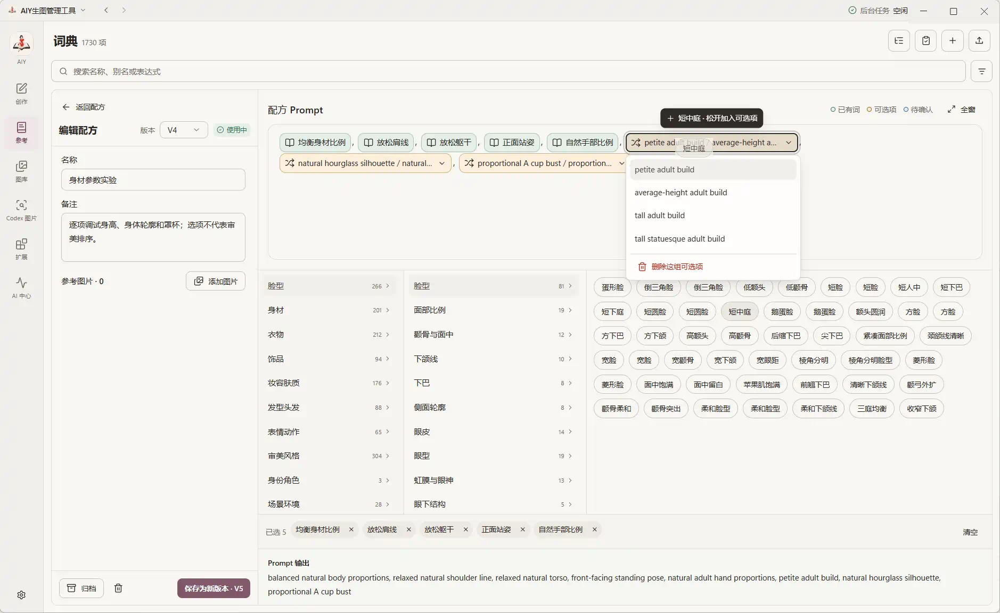
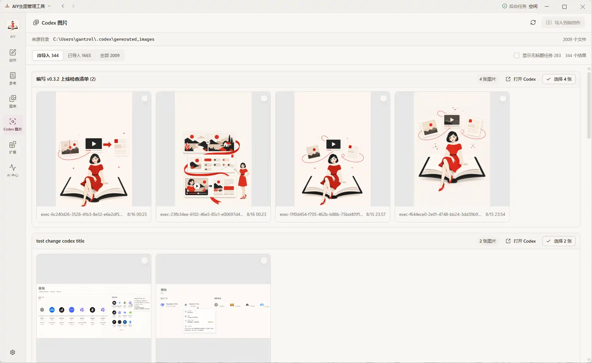

# 开源工具AIY：AI帮你DIY

桌面工具AIY，不受对话限制，用成果维度管理，延伸出可积累词典跟素材。

你可以：

- 生成图片，需要自行配置本地 Codex 或相关 API 服务；
- 比较不同模型、参数和提示词版本，比较图片差异；
- 导入外部图片，加入对比；

- 视频转图文，带插图、可编辑、方便后续检索；

- 按产出组织提示词版本、参考素材和生成结果，而非散落到对话；
- 复用指令到词典、配方和参数；

- 导入含创作、素材、词条或配方的内容包；
- 发现并导入本地 Codex 图片记录，同时保留素材来源信息（这也是内置插件之一）。

以上只是部分功能。你可以在[微软商城下载](https://apps.microsoft.com/detail/9nwd1hg6tczh)，它的版本不能用0开头，1.3.2.0对应开源0.3.2。

或者去[开源仓库](https://github.com/gantrol/aiy-desktop)自行编译最新版。

> ⚠️虽然目前性能足以管理上万张图片，但目前仍在早期开发阶段。开发时间跨度仅两到三周，一人非全职开发，有很多要完善的地方。另外，这是Electron应用，“技术洁癖”者可以绕道。

近期规划：

- 继续优化视频转图文，且寻找免费资源。目前考虑到谷歌相关模型、Agent在图像识别领域比较厉害，且有一定免费额度，视频转图文的功能会主要适配谷歌模型；
- 优化外部创作的导入、对比等更细的交互，拓展更多常见图片格式；
- 统一文稿、图片、视频的管理。从“图片AIY”走向通用。比较快实现的功能是，公众号的题图或贴图封面，也会马上公开本公众号常用的提示词。
