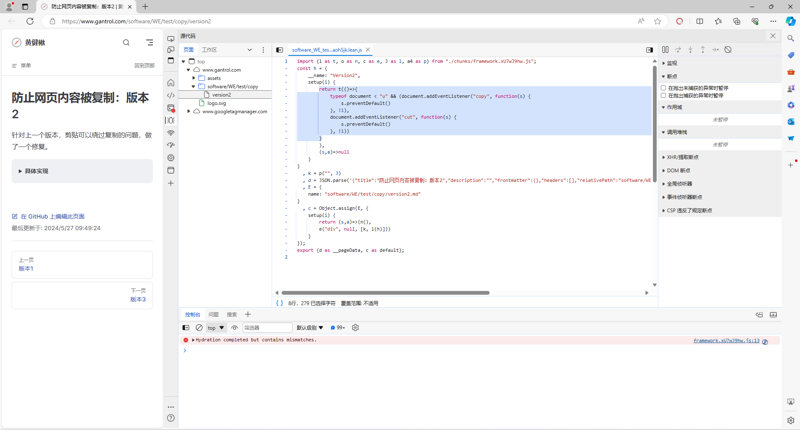

# 插件攻防第二轮：禁止事件

[防止网页内容被复制：版本2](../test/copy/version2)这个网页禁止了复制，现在来研究一下，先按`Ctrl+Shift+C`
打开开发者工具的“元素”标签页，然后执行下列步骤：

1. 点击事件侦听器；
2. 展开`copy`事件；
3. 点击对应链接


发现核心代码为：

```js
document.addEventListener("copy", function (s) {
    s.preventDefault()
}, !1)
```



## 一种破解思路

只要上面那段代码不发挥作用就可以了。可以使用[`stopImmediatePropagation`](https://developer.mozilla.org/en-US/docs/Web/API/Event/stopImmediatePropagation)阻止事件继续传播，示例代码：

```js
document.addEventListener("copy", function (e) {
    e.stopImmediatePropagation()
}, true)
```

## 实现插件代码

顺带一提，考虑到这种思路可能会影响部分网站的正常功能，于是也做成开关形式，受影响时可以取消。

### 实现开关

先假设有一个函数`bypassCopyProtection`能实现上述思路，基于[模板](template)的代码，添加[`chrome.scripting.executeScript`](https://developer.chrome.google.cn/docs/extensions/reference/api/scripting?hl=zh-cn)在对应标签页注入这个函数的逻辑：

```js
const on = 'ON';

function bypassCopyProtection(isCopyable) {
    // 只是调试
    debugger;
}

chrome.action.onClicked.addListener(async (tab) => {
    let text = await chrome.action.getBadgeText({ tabId: tab.id });

    if (text === on) {
        text = '';
    } else {
        text = on;
    }

    chrome.action.setBadgeText({ tabId: tab.id, text: text });

    const isCopyable = text === on;

    chrome.scripting.executeScript({
        target: {
            tabId: tab.id,
            allFrames: true,

        },
        function: bypassCopyProtection,
        args: [isCopyable]
    });
});
```

- 在浏览器加载或重新加载这个插件
- 在[防止网页内容被复制：版本2](../test/copy/version2)这个网页，按键盘的`F12`打开开发者工具
- 点击工具栏中的插件图标

如果你的操作正确，那么将会触发debug，否则检查之前代码或操作步骤

### 一步步实现`bypassCopyProtection`

输入是个布尔值`isCopyable`，那代码一定会有一个分支，可以是：

```js
if (isCopyable) {
    // 解开copy限制
} else {
    // 撤销解开copy限制
}
```

加入`stopImmediatePropagation`的逻辑，要解开限制时加入事件监听器，反之则去除：

```js
function bypassCopyProtection(isCopyable) {
    if (isCopyable) {
        document.addEventListener('copy', (e) => e.stopImmediatePropagation(), true);
    } else {
        document.removeEventListener('copy', (e) => e.stopImmediatePropagation(), true);
    }
}
```

:::details 这里有一个问题，你可以先自行发现并尝试修复它，可以利用之前的`debugger`，也可以在开发者工具中的控制台手动调试

#### 手动调试

- 在[防止网页内容被复制：版本2](../test/copy/version2)对应的控制台输入`document.addEventListener('copy', (e) => e.stopImmediatePropagation(), true);`，发现可以正常复制；
- 接着输入`document.removeEventListener('copy', (e) => e.stopImmediatePropagation(), true);`，发现还是可以正常复制

#### 判定问题

两个`(e) => e.stopImmediatePropagation()`看起来是一样的，但其实是“两个”函数。

#### 一种解决方案

将第一次注入的监听器用标签页对应的`window`变量存储，比方说：

```js
if (window.copyableHandler === undefined) {
    window.copyableHandler = (e) => {
        e.stopImmediatePropagation();
    };
}
```

至此，`bypassCopyProtection`完整代码就是：

```js
function bypassCopyProtection(isCopyable) {

    if (window.copyableHandler === undefined) {
        window.copyableHandler = (e) => {
            e.stopImmediatePropagation();
        };
    }

    if (isCopyable) {
        document.addEventListener('copy', window.copyableHandler, true);
    } else {
        document.removeEventListener('copy', window.copyableHandler, true);
    }
}
```

:::

## 总结与思考

跟[第一个版本](version1)一样，涉及到了背景脚本、工具栏、标签页三类。

虽然「背景脚本」能向标签页注入代码，但它们的“变量环境”是完全不同的，如果将`bypassCopyProtection`改成：

```js
function copyableHandler(e) {
    e.stopImmediatePropagation();
}

function bypassCopyProtection(isCopyable) {
    if (isCopyable) {
        document.addEventListener('copy', copyableHandler, true);
    } else {
        document.removeEventListener('copy', copyableHandler, true);
    }
}
```

重新加载插件，点击工具栏，对应页面会报错——找不到`copyableHandler`。

此外，本节还涉及了一点浏览器开发者工具跟调试相关的内容。

## 接下来

根据本节的知识，解除版本3网页的复制限制——[防止网页内容被复制：版本3](../test/copy/version3)
