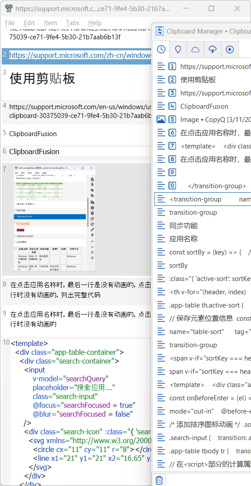

# 剪切板管理器：同时复制十几个“对象”

系统剪切板一般只保留一项，有时想同时复制多项，怎么办？Windows跟Mac操作系统都有自带，但都不太好用，可能内网电脑开来缓解一下也是好的[^1]

搜寻一番（以Windows为主），挑出CopyQ跟ClipboardFusion这俩。 其他软件可以参考文末表格。

CopyQ能展示图片、带格式文本，有Windows跟Mac端、无移动端；ClipboardFusion付费后有同步功能，几乎全平台但Mac、iOS端很难用（评分1.5）。

[//]: # (怎么搜索图片)

<ClipboardCompare />

[^1]: [Windows 使用剪贴板](https://support.microsoft.com/zh-cn/windows/%E4%BD%BF%E7%94%A8%E5%89%AA%E8%B4%B4%E6%9D%BF-30375039-ce71-9fe4-5b30-21b7aab6b13f) 
