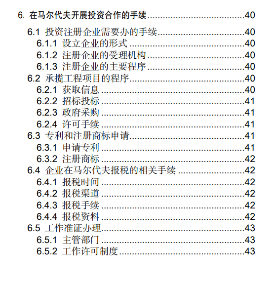
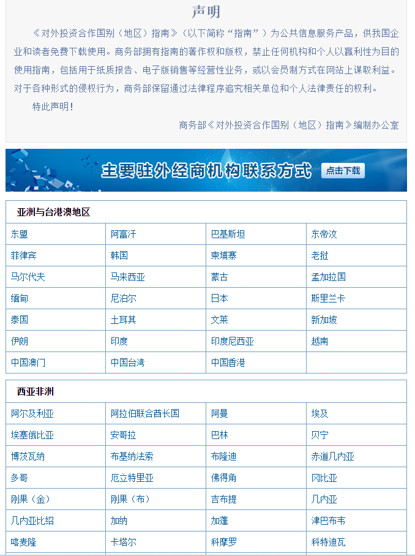

# 「“走出去”公共服务平台」与《对外投资合作国别（地区）指南》介绍

:::info 当前状态
草稿
:::

《[对外投资合作国别（地区）指南](http://fec.mofcom.gov.cn/article/gbdqzn/index.shtml)》，十分详尽。包括上百个国家、地区或组织。

以[马尔代夫的指南](https://www.mofcom.gov.cn/dl/gbdqzn/upload/maerdaifu.pdf)为例，涵盖地理、文化、经贸、投资等基本内容，更有一些手续上的基本指南。

就算只有地理文化，也能算是比较好的地理通识读物。

## 网站截图

